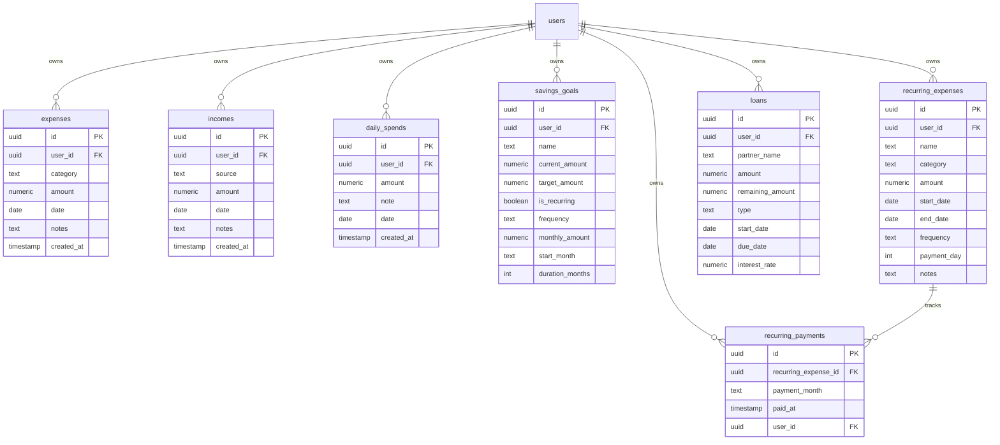

# Database Model Overview

This document provides a visual representation of the `tk-kothay` database schema.

### Key Relationships
- **User Ownership**: All tables are linked to the Supabase `auth.users` table via `user_id`. Row Level Security (RLS) ensures users can only see their own data.
- **EMI Tracking**: The `recurring_payments` table links to `recurring_expenses` to track which specific months of a recurring bill have been paid.
